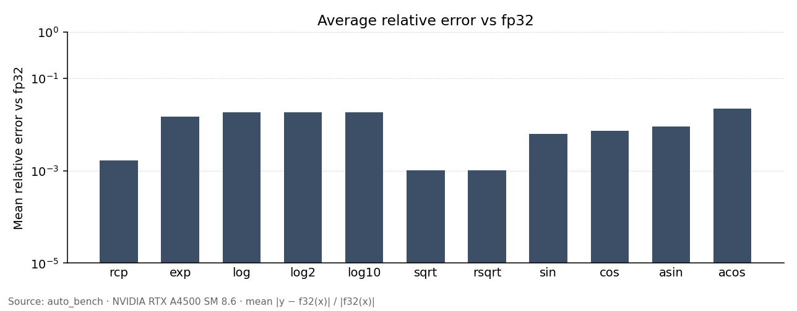

# FP16 fast-math report

NVIDIA RTX A4500, SM 8.6, release 13.0, `-arch=native`.

## Method

- Four implementations: this library (`half2`), CUDA `h2*`, fp32, and fp32 compiled with `-use_fast_math`.
- Accuracy: mean relative error vs host fp32, `|y − f32(x)| / |f32(x)|` (log axis 10⁻⁵ … 10⁰, step 10²).
- Throughput: 8 independent chains per thread; GElem/s counts scalar results. Speedup is library throughput ÷ baseline.
- Latency: one dependent chain; `clock64()` cycles per call.
- SASS: instruction mix of the latency kernel. This library is ALU-only (no MUFU).

## Accuracy



## Performance

| Function | GElem/s | vs h2 | vs fast-math | vs fp32 | Cycles |
| --- | --- | --- | --- | --- | --- |
| rcp | 1425 | 1.00× | 0.94× | 1.33× | 47 |
| exp | 1470 | 1.10× | 0.90× | 1.25× | 52 |
| log | 2449 | 1.91× | 1.47× | 5.29× | 40 |
| log2 | 2473 | 1.53× | 1.47× | 5.73× | 36 |
| log10 | 2450 | 1.91× | 1.48× | 5.56× | 40 |
| sqrt | 2164 | 1.31× | 1.29× | 1.78× | 44 |
| rsqrt | 2606 | 1.57× | 1.55× | 1.56× | 40 |
| sin | 761 | 1.57× | 0.47× | 1.48× | 107 |
| cos | 754 | 1.69× | 0.46× | 1.53× | 102 |
| asin | 1666 | 3.20× | 3.15× | 3.18× | 31 |
| acos | 1483 | 2.82× | 3.02× | 2.79× | 34 |

## SASS (this library)

`cuobjdump -sass` on the latency kernel. **ALU** = packed fp16 math + integer
logic + converts (software path). **MUFU** = hardware special-function unit.
Regs = throughput kernel.

| Function | ALU | MUFU | Regs |
| --- | --- | --- | --- |
| rcp | 20 | 0 | 28 |
| exp | 14 | 0 | 29 |
| log | 19 | 0 | 25 |
| log2 | 17 | 0 | 24 |
| log10 | 19 | 0 | 25 |
| sqrt | 16 | 0 | 28 |
| rsqrt | 14 | 0 | 20 |
| sin | 41 | 0 | 40 |
| cos | 39 | 0 | 40 |
| asin | 16 | 0 | 33 |
| acos | 18 | 0 | 34 |

## Rerun

```bash
cd microbenchmarkSFU/auto_bench
./run_auto_bench.sh
./run_auto_bench.sh --arch sm_90
```
